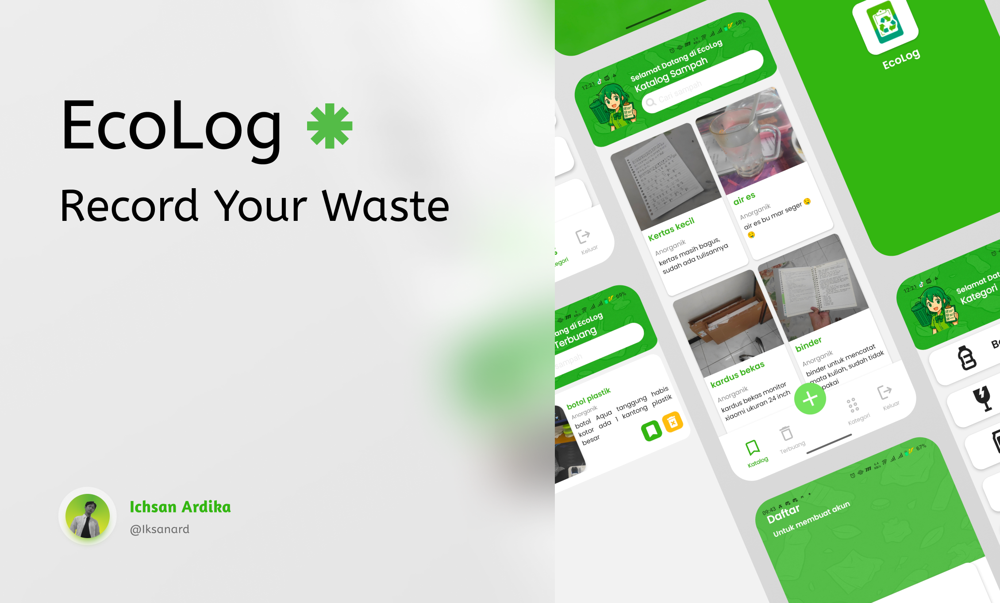
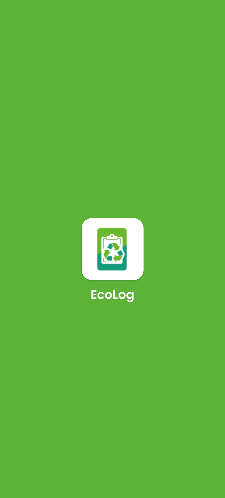
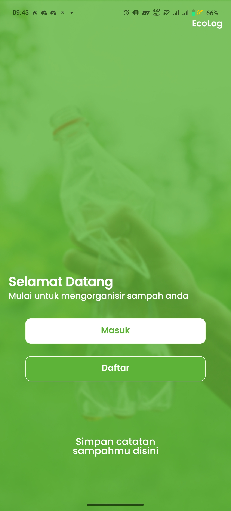
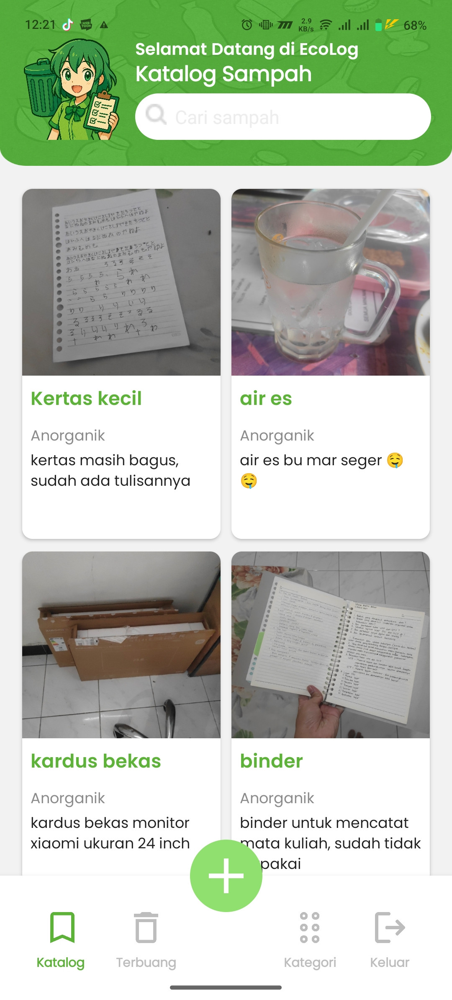
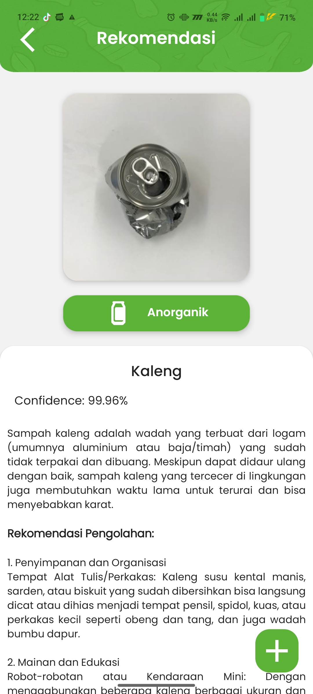
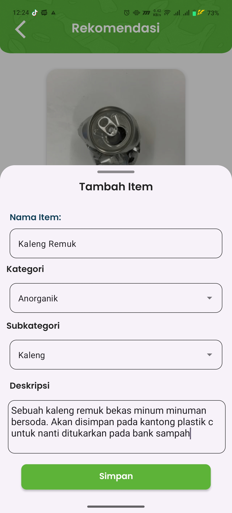

# Eco-log ♻️  
*An Android-based app for smarter household waste classification and management.*  


---

## 📖 Overview  
Eco-log is a project developed to **classify and record household waste** using a combination of **mobile development** and **machine learning**.  
The goal of this application is to encourage better **waste management practices** and promote **environmental sustainability** in everyday life.  

---

## 📂 Repository Structure  
This repository consists of two main parts:  

```
.
├── aplikasi/          
└── machine_learning/  
```

- **aplikasi/** → Contains the Android application source code.  
- **machine_learning/** → Contains scripts and notebooks for dataset preparation, training, and exporting TFLite models.  

---

## ✨ Features  
- 🔍 Waste classification (organic, anorganic, B3) with TensorFlow Lite  
- 📂 Waste catalog 
- ☁️ Firebase for database  
- 🖼️ Image storage using Cloudinary  
- 📱 Built with MVVM architecture for scalability  

---

## 🛠️ Tech Stack  
**Mobile App (aplikasi/):**  
- Kotlin, Android Studio  
- MVVM Architecture, Coroutines, Dagger Hilt  
- Firebase Auth & Firestore  
- Cloudinary for image storage  

**Machine Learning (machine_learning/):**  
- Python 3.x  
- TensorFlow / TensorFlow Lite  
- NumPy, Pandas, Matplotlib  
- Pre-trained MobileNetV2 model  

---

## 🚀 Setup & Installation  

### 📱 Android App (aplikasi/)  
1. Clone this repository:  
   ```bash
   git clone https://github.com/MokkaNeko/eco-log.git
   ```
2. Open the `aplikasi/` folder in **Android Studio (Ladybug or newer)**.  
3. Configure Firebase (Auth & Firestore) and Cloudinary credentials in the project.  
4. Build & run the app on an Android emulator or device.  

### 🤖 Machine Learning (machine_learning/)  
1. Navigate to the `machine_learning/` folder:  
   ```bash
   cd eco-log/machine_learning
   ```
2. Create a virtual environment and install dependencies:  
   ```bash
   pip install -r requirements.txt
   ```
3. Run training scripts or Jupyter notebooks for dataset preprocessing and model training.  
4. Export the model to **TFLite format** for integration with the Android app.  

---

## 📸 Usage & Demo  
Screenshots of the application:  

| Splash Screen | Welcome Screen | Register |
|-------------|-----------------------|---------------|
|  |  |  |

| Home Screen | Classification Result | Add to Catalog |
|-------------|-----------------------|---------------|
|  |  |  |

Example output of classification:  
- Input: Plastic Bottle → Output: **Botol Plastik**  
- Input: Food Waste → Output: **Sisa Makanan dan Dedaunan**  

---

## 🔮 Future Improvements  
- Collaborating with relevant institutions to achieve more structured waste management
- Adding features such as processing location, processing recommendation videos, and chat with related institutions
- Adding social features to enable waste exchange with other users
- Adding gamification features such as a point system for each successfully exchanged waste
- Optimize ML model for better accuracy & efficiency  
- Expand dataset for more waste categories  

---

## 👥 Contributors  
- **Ichsan** → [Ichsan Ardika Akbar](https://linkedin.com/in/ichsan-ardika)

---

## 📄 License  
This project is licensed under the **[MIT License](LICENSE)** – feel free to use and modify with attribution.  

---

🌱 *Eco-log is built with passion for technology and sustainability.*

